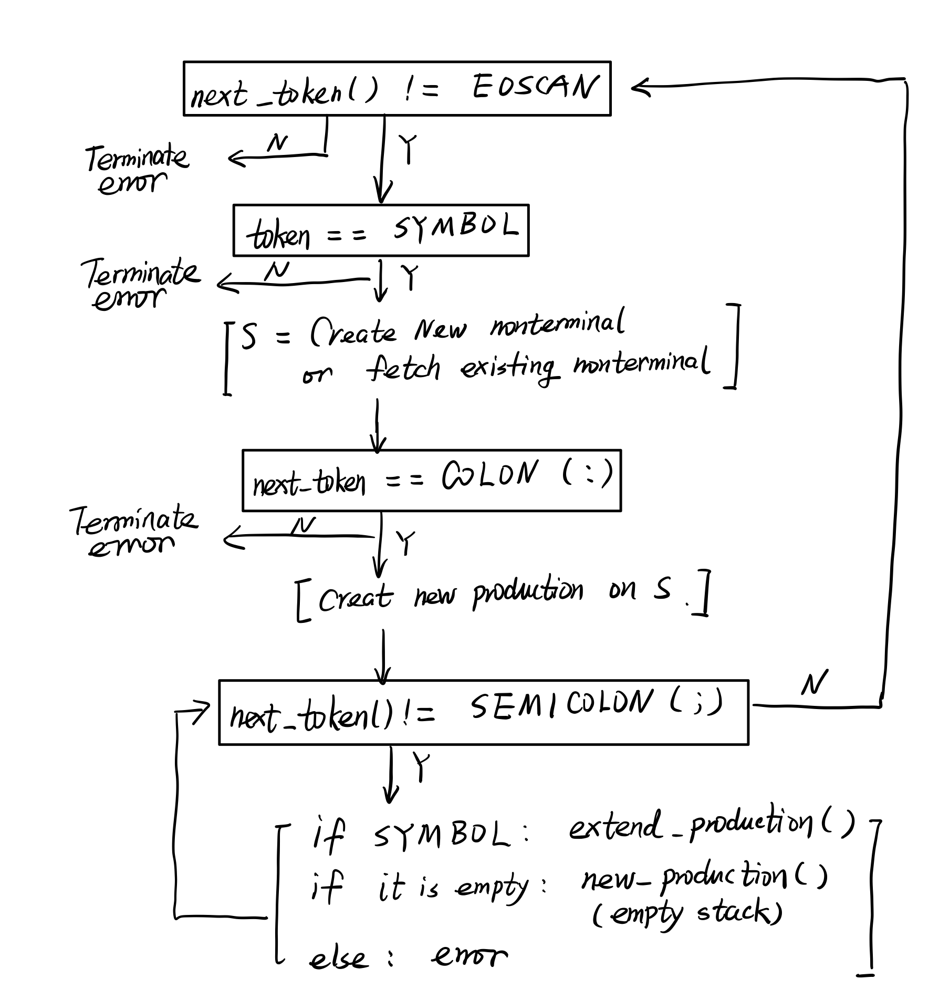
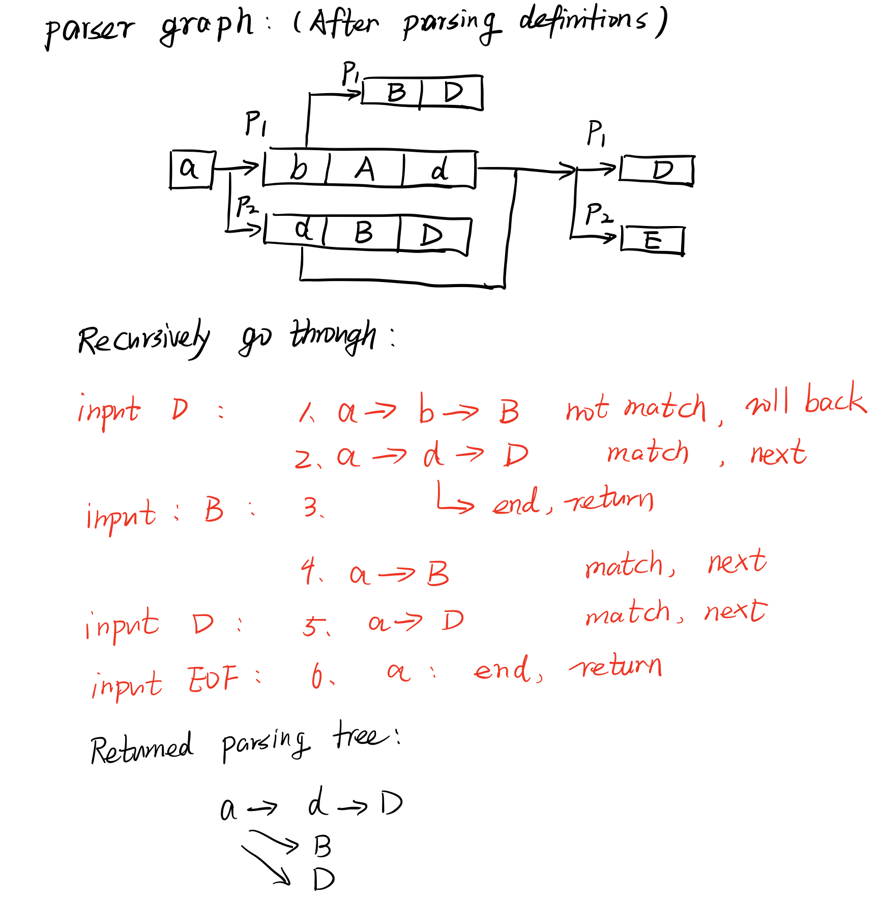

### Purpose

---

Design and implement a LL(1) parser accepting customized non-terminal and terminal definitions and cooperate with the previous scanner.

### **Method and Design**

---

The parser has two function parts: one for reading definitions of nonterminals, the other for parsing the source file according to the nonterminal definitions.

If not specified, all files mentioned are under `/parser`.

#### Definition reading

##### Token definition reading & parsing

Refer to `README.md` under `/scanner`

##### Nonterminal definition grammar

The grammar of nonterminal definition is as follows:

​	`NAME: productionA | productionB | ... | ;`

 This description supports EMPTY (or lambda) by simply omitting the production, like the end of the above example. Note that there is no need to deliberately add space between tokens  `; | :` and production or nonterminal names. 

Notice: 

	1. You can freely modify the definition. However, make sure the grammar described is valid LL(1) grammar.
	2. Put the more general nonterminal before the less general ones. Especially, the parser requires a most general nonterminal to be put as the first one since all parsing will be based on the expansion of the first nonterminal.
	3. There is no need to define nonterminals before their usage. The definition parser will automatically associate the definitions and the occurrences regardless of their relative position.

##### Nonterminal definition parsing

The parsing process is done by function `parse_script()` in `/parser/sparser.c`. It relies on the general scanner function `next_token()` defined in `/lib/sscanner.c` which will return next token once invoked.

Nonterminal is expressed as a struct `symbol` defined in `productions.h` which contains a pointer to a stack for storing productions. `symbol` has two types, one is `NONTERMINAL`, the other is `TERMINAL`, or token. Since production is a linear collection of nonterminals and terminals, it is represented by a stack of symbols. Thus the stack pointer in struct `symbol` points to a stack of stack (production). And the production stack stores other symbols. Thus, for `NONTERMINAL` symbol, it is a parsing graph by itself (not tree since recursion may present).

`parse_script()` will generate new symbols and insert the productions. This is done by function  `get_symbol()` (for adding new nonterminals), `new_production()` (for add a new stack in the productions stack of symbol), and `extend_by_name()` (for adding symbols to the top of productions stack by the string name).

Nonterminals are stored in global stacks `symbols` and `symbol_names` which are for producitons and names respectively. Nonterminal and its lexical name are associated by the index stored in `symbol.code`.



Note that EMPTY (or lambda) in productions is expressed as an empty stack in productions stack.

##### Reduce left recursion

After parsing definitions, `p_sparse_main.c` will call `reduce_left_recursion()` on every nonterminal to reduce left recursion.  The reducing algorithm is:

Suppose `A |-> A a;`

1. generate two new tmp symbols `tmpA` and `tmpB` (nonterminal)

2. copy all other non-left-recursion productions of `A` to `tmpA`

3. copy the remaining part of the left-recursion production to `tmpB` and add itself to that production. Also an empty production is added: `tmpB |-> a tmpB; |-> EMPTY;` 

4. modify the original left-recursion production to `tmpA tmpB`: 

   `A |-> A a;` -> `A |-> tmpA tmpB`

Example: 

Nonterminnal to be eliminated:

`exp: exp operator exp | NOT_OP exp | LPAR exp RPAR  | MINUS exp | INT_NUM | ID index;`

1. `tmpA: NOT_OP exp | LPAR exp RPAR  | MINUS exp | INT_NUM | ID index;`
2. `tmpB: operator exp tmpB | ;`
3. `exp: tmpA tmpB;`

Note that the tmp nonterminals will be assigned with a unique random string that may contain unreadable characters for avoiding collision with defined nonterminals. The name generation and tmp nonterminal inserting is done by `gensym()` defined in `production.c`.

Function `reduce_left_recursion()` in `production.c ` is a direct translation of that procedure.

#### Parsing source

After parsing the definition file, the parser is ready for generating parsing tree. 

##### General algorithm

LL(1) with recursion. Essentially, the parsing results of the definitions of nonterminals are stack-based parsing graph of nonterminals. Or, the AST of nonterminal definitions are right the parsing graph for each nonterminal (it is a graph not a tree because of the existence of recursion). 

So the matching function will recursively go through (Depth First) the parsing graph and trying to associate actual tokens with the terminal nodes of the parsing tree to generate the actual parsing tree. This process is naturally a top-down, left-to-right derivation. By LL(1), it will read one token each time and try to match it with the next valid terminal of the production. In other words, the recursion expansion is right the process of finding predict set of next symbol. There are four cases:

 1. if the symbol is the first one in the production, and next token is valid for that symbol, then move forward to match next symbol in this production.

 2. if the symbol is the first one in the production, and the matching failed, then it will move to next production. 

    The above two are called "first test", which is equivalent to the process of locating proper production rule in table-driven LL(1).

 3. if the symbol is not the first one in the production, and the matching succeeds, then move forward.

 4. if the symbol is not the first one in the production, and the matching failed, signal an error. It is the same as accessing empty entry of the LL(1) table in table-driven LL(1). Either the input token is invalid or the production definition has errors.

The main parsing procedure is in function `recursive_apply()` in `match.c`.



##### Tricks about reserved word

Note that here the parsing algorithm above tolerates some kind of common prefix (productions with intersection in predict set). It helps in dealing with reserved word like `while` `main` since they are also valid `IDENTIFIER`. You may notice that in the production definition file offered (`test.productions`)  `control_statement`, `read_write_statement` are placed before `assign_statement`. The trick is putting nonterminals with reserved word as head will make them match the input eariler, avoiding the parser recognizing reserved word as common `IDENTIFIER`.

##### Reading tokens

The input of the parsing process is the tokenized source file. It is offered by function `next_token_s()` (means next token in source) in `/scanner/scanner_main.c`. Since it operates on the string returned by`next_unit()` which splits source file by blanks, `next_token_s()` maintains several local static variables for marking the read / unread segment of the string. Once called, `next_token_s()` will feed the string & index into `languagep()` in `/scanner/spredicate.c` to match tokens.

 `languagep()` will return the index of token in the stack `regex` and `token_names` as token code and update the index if successfully matched. If not, it will return `-1`. The details of that matching function is described in `README.md` under `/scanner`.

Once valid token code is returned, `next_token_s()` will copy the matched string to the global variable `text`. It has the same role as `yytext` in flex.

##### Generating parsing tree

The tree is represented by struct `ast_node` in `AST.h`. It has three types: `NONTERMINAL`, `TERMINAL`, and `EMPTY`. The `EMPTY` is only used for avoiding empty production consumes tokens and will not appear in the finally generated parsing tree. `NONTERMINAL` acts as non-leaf node in the parsing tree while `TERMINAL` is the leaf node. 

When the for loop in `recursive_apply()` go through every element of the production, it will insert the recursion result into the stack of  the `NONTERMINAL` node denoting current symbol. By recursion the final returned result is right the root node of the parsing tree starting from the passed-in symbol.

For the base case of the recursion, when the argument symbol s is a `TERMINAL` and matched, it will copy the matched text to the node and return the atom node. Thus every matched token in the parsing tree will keep an record of the matched text. 

The parsing tree will be printed by `print_tree()`.


### Experiment Environment

---

#### System Information

Kernel info:

```shell
$ uname -a
Linux xen134-VirtualBox 5.8.0-48-generic #54-Ubuntu SMP Fri Mar 19 xx:xx:xx UTC 2021 x86_64 x86_64 x86_64 GNU/Linux
```

CMake version:

```shell
$ cmake --version
cmake version 3.17.3

CMake suite maintained and supported by Kitware (kitware.com/cmake).
```

gcc version:

```shell
$ gcc --version
gcc (Ubuntu 10.2.0-13ubuntu1) 10.2.0
Copyright (C) 2020 Free Software Foundation, Inc.
This is free software; see the source for copying conditions.  There is NO
warranty; not even for MERCHANTABILITY or FITNESS FOR A PARTICULAR PURPOSE.
```

#### Compile and Run

1. unzip the source code and switch the source folder as working directory:

   ```shell
   $ cd SOURCE_PATH
   ```

2. Use cmake to generate makefile

   ```shell
   $ cmake ./
   ```

3. make to compile

   ```shell
   $ make
   ```

   after that the files under current directory should be

   ```shell
   $ ls
   CMakeCache.txt  cmake_install.cmake  lib     Makefile              micro_c.tokens  parserBin  			test.source
   CMakeFiles      CMakeLists.txt       main.c  micro_c.nonterminals  parser  scanner
   ```

4. run `parserBin`

   ```shell
   $ parserBin -s ./test.source
   ```

   `parserBin` accepts one required argument and two optional arguments:

   ​	`-s`: required. The path of source file to be parsed

   ​	`-t`: optional. The path of token definition file. If not specified, it will use `micro_c.tokens` under current directory.

   ​	`-n`: optional. The path of nonterminal definition file. If not specified, it will use `micro_c.nonterminals` under current directory.

   

### Test Result

---

Input source file:

```c
if (b) {
	if (a) a = 1; 
} else b = 2;

if (a) 
	if (b != 2) return;
else {
	c = 3;
}
else
	do {
		d = 4;
		printf(1+a-c*b)
		;
		scanf(a);
	} while (1);
```

Output:

```
 |-> non-terminal: program
  |-> non-terminal: statements
    |-> non-terminal: statement
      |-> non-terminal: control_statement
        |-> non-terminal: if_statement
          |-> non-terminal: if_stmt
            |-> terminal: IF: if
            |-> terminal: LPAR: (
            |-> non-terminal: exp
              |-> terminal: ID: b
            |-> terminal: RPAR: )
            |-> non-terminal: code_block
              |-> terminal: LBRACE: {
              |-> non-terminal: statements
                |-> non-terminal: statement
                  |-> non-terminal: control_statement
                    |-> non-terminal: if_statement
                      |-> non-terminal: if_stmt
                        |-> terminal: IF: if
                        |-> terminal: LPAR: (
                        |-> non-terminal: exp
                          |-> terminal: ID: a
                        |-> terminal: RPAR: )
                        |-> non-terminal: code_block
                          |-> non-terminal: statement
                            |-> non-terminal: assign_statement
                              |-> terminal: ID: a
                              |-> non-terminal: assign_op
                                |-> terminal: ASSIGN: =
                                |-> non-terminal: exp
                                  |-> terminal: INT_NUM: 1
                            |-> terminal: SEMI: ;
              |-> terminal: RBRACE: }
          |-> non-terminal: if_tail
            |-> terminal: ELSE: else
            |-> non-terminal: code_block
              |-> non-terminal: statement
                |-> non-terminal: assign_statement
                  |-> terminal: ID: b
                  |-> non-terminal: assign_op
                    |-> terminal: ASSIGN: =
                    |-> non-terminal: exp
                      |-> terminal: INT_NUM: 2
                |-> terminal: SEMI: ;
    |-> non-terminal: statements
      |-> non-terminal: statement
        |-> non-terminal: control_statement
          |-> non-terminal: if_statement
            |-> non-terminal: if_stmt
              |-> terminal: IF: if
              |-> terminal: LPAR: (
              |-> non-terminal: exp
                |-> terminal: ID: a
              |-> terminal: RPAR: )
              |-> non-terminal: code_block
                |-> non-terminal: statement
                  |-> non-terminal: control_statement
                    |-> non-terminal: if_statement
                      |-> non-terminal: if_stmt
                        |-> terminal: IF: if
                        |-> terminal: LPAR: (
                        |-> non-terminal: exp
                          |-> terminal: ID: b
                          |-> non-terminal: operator
                            |-> terminal: NOTEQ: !=
                          |-> non-terminal: exp
                            |-> terminal: INT_NUM: 2
                        |-> terminal: RPAR: )
                        |-> non-terminal: code_block
                          |-> non-terminal: statement
                            |-> non-terminal: control_statement
                              |-> non-terminal: return_statement
                                |-> terminal: RETURN: return
                              |-> terminal: SEMI: ;
                      |-> non-terminal: if_tail
                        |-> terminal: ELSE: else
                        |-> non-terminal: code_block
                          |-> terminal: LBRACE: {
                          |-> non-terminal: statements
                            |-> non-terminal: statement
                              |-> non-terminal: assign_statement
                                |-> terminal: ID: c
                                |-> non-terminal: assign_op
                                  |-> terminal: ASSIGN: =
                                  |-> non-terminal: exp
                                    |-> terminal: INT_NUM: 3
                              |-> terminal: SEMI: ;
                          |-> terminal: RBRACE: }
            |-> non-terminal: if_tail
              |-> terminal: ELSE: else
              |-> non-terminal: code_block
                |-> non-terminal: statement
                  |-> non-terminal: control_statement
                    |-> non-terminal: do_while_statement
                      |-> terminal: DO: do
                      |-> non-terminal: code_block
                        |-> terminal: LBRACE: {
                        |-> non-terminal: statements
                          |-> non-terminal: statement
                            |-> non-terminal: assign_statement
                              |-> terminal: ID: d
                              |-> non-terminal: assign_op
                                |-> terminal: ASSIGN: =
                                |-> non-terminal: exp
                                  |-> terminal: INT_NUM: 4
                            |-> terminal: SEMI: ;
                          |-> non-terminal: statements
                            |-> non-terminal: statement
                              |-> non-terminal: read_write_statement
                                |-> non-terminal: write_statement
                                  |-> terminal: WRITE: printf
                                  |-> terminal: LPAR: (
                                  |-> non-terminal: exp
                                    |-> terminal: INT_NUM: 1
                                    |-> non-terminal: operator
                                      |-> terminal: PLUS: +
                                    |-> non-terminal: exp
                                      |-> terminal: ID: a
                                      |-> non-terminal: operator
                                        |-> terminal: MINUS: -
                                      |-> non-terminal: exp
                                        |-> terminal: ID: c
                                        |-> non-terminal: operator
                                          |-> terminal: MUL_OP: *
                                        |-> non-terminal: exp
                                          |-> terminal: ID: b
                                  |-> terminal: RPAR: )
                              |-> terminal: SEMI: ;
                            |-> non-terminal: statements
                              |-> non-terminal: statement
                                |-> non-terminal: read_write_statement
                                  |-> non-terminal: read_statement
                                    |-> terminal: READ: scanf
                                    |-> terminal: LPAR: (
                                    |-> terminal: ID: a
                                    |-> terminal: RPAR: )
                                |-> terminal: SEMI: ;
                        |-> terminal: RBRACE: }
                      |-> terminal: WHILE: while
                      |-> terminal: LPAR: (
                      |-> non-terminal: exp
                        |-> terminal: INT_NUM: 1
                      |-> terminal: RPAR: )
                    |-> terminal: SEMI: ;
----
```

Clearly we can see it handles if-else perfectly. In the first if statement else matches with the outer if, while in the second if statement the first else matches with the inner if.

However, the precedence of operators is not processed here. It will be added in code generator since operator precedence parsing is LR() and for LL(1) it has to be handled after the parsing process. 

